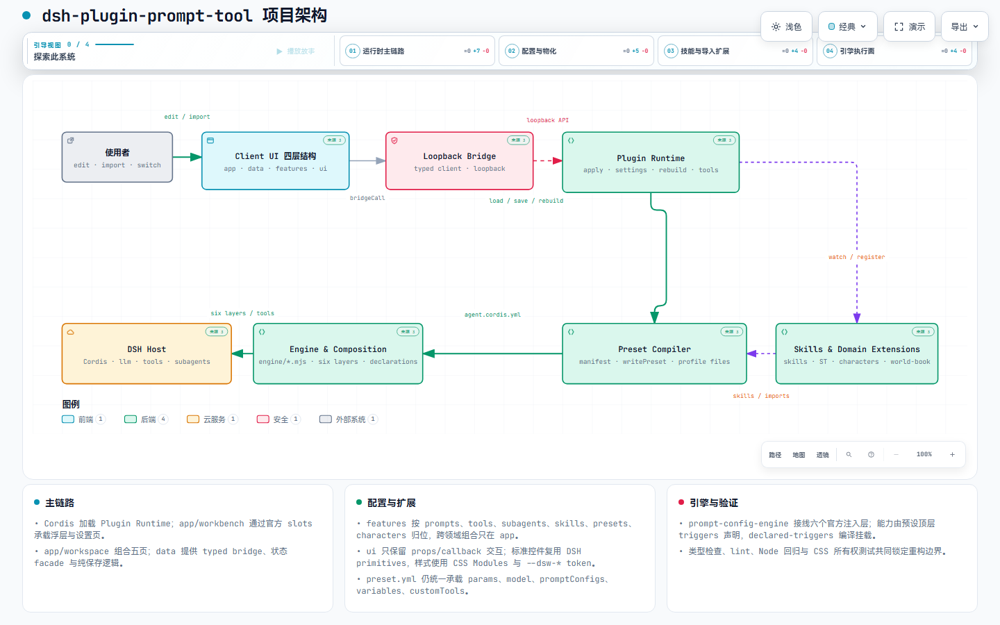

# dsh-plugin-prompt-tool — 层级提示词注入器

> 一切皆可注入：把 DSH 官方开放的全部注入层级收敛为一个可配置提示词注入引擎——注入什么、注入到哪一层、何时注入，全由提示词配置决定。

DSH 生态的提示词注入标准层：一个 `prompt-config-engine.mjs` 接线官方六个插入点（`agent/pre-step`、`systemPrompt.section`、`systemPrompt.context`、`agent/request`、`llm/stream`、`tools/*`），内置 anchored 默认预设，开箱即用。

> 策略来源：工具目录锚定 [dsh-anchored-standard](https://github.com/xiaobright/dsh-anchored-standard)、近距离引导 [dsh-router-standard](https://github.com/yjh051108/dsh-router-standard)、缓存铁律 [dsh-super-injector](https://github.com/yjh051108/dsh-super-injector)。

## 安装

```bash
dsh plugin --profile prompt-tool add dsh-plugin-prompt-tool        # npm 安装
dsh plugin --profile prompt-tool add link:<本仓库绝对路径>          # 本地源码（link 覆盖 registry）
dsh --profile prompt-tool                                          # 首次启动自动补 dsh-web-app，二次启动生效
```

需要 DSH `0.1.1-rc.1+`。

## 特性

- 🔌 **六个官方插入点一次接线**：一个引擎注册全部可注入层级，共享同一套过滤与降级语义
- ✍️ **一切皆可配置**：`layer / strategy / position / promotion / subagents / modelScope / mergeMode / order / text / texts / fill / variables / params` 全开放
- 🧑‍🤝‍🧑 **子代理三态**：`subagents: none / inherit / only`，身份类提示词可只注入子代理
- 🗂️ **内容与执行分离**：每条提示词配置渲染为 `~/.dsh/.agent-presets/<预设>/prompt-configs/` 下的 yml，引擎按文件名数字前缀顺序扫描
- 🧩 **三层合并**：引擎默认（按 params 生成）< 模板默认 promptConfigs < 预设 promptConfigs，同名 `id` 覆盖
- 🖥️ **官方 slot 工作台**：`shell.overlay` 驱动的左上角悬浮按钮通过 body portal 落在对话界面层，右侧抽屉（主会话/子代理/技能设置/预设配置/角色管理五页）仍由官方 slot 承载；按钮纵向位置独立于其他插件，`sidebar.footer.action` 几何探针仅跟随官方侧栏的 264px 起步、可拉伸及 36px 折叠宽度，并保留 15px 横向间距；UI 挂载全部交给官方 SlotRegistry，无宿主 DOM 选择器
- 🧪 **七种内容策略**：`static / first-turn-anchor / guide-auto / custom-fallback / instruction-hint / placeholder / world-book`（world-book 支持 ST selectiveLogic 选择性触发：任一/副键全中/排除）
- 🛡️ **失败不伤会话**：单条失败跳过 + `warnOnce`；配置错误挂载时 fail loud；`dedupe: session` 持久幂等
- 📦 **Bridge 载荷**：JSON 请求统一 32 MiB 硬上限并明确返回 413；角色卡原始图片走 64 MiB 流式通道，按 PNG 魔数识别。
- 🎭 **SillyTavern 导入**：JSON 预设卡片一键转换为本地预设——`prompts[]` 映射提示词配置、setvar/getvar 收集进顶层 `variables`（未定义自定义宏自动登记空值占位）、`enable_web_search` 按开关装配工具；采样参数剥离（模型设置 UI 管理）
- 🎴 **角色卡库**：SillyTavern 角色卡（PNG tEXt chunk `ccv3`/`chara`，或 chara_card JSON）导入独立库（`.characters/<id>/`，含原图/转换参数/角色记忆），按 PNG 魔数识别图片并经原始文件流上传，避免头像 base64 膨胀；按需「导入到当前预设」（`chara-<卡>-` 前缀合并、幂等可移除），多文件自动合并
- 📚 **世界书**：`character_book` 转 world-book 策略配置（`keys` 命中触发 / `constant` 常驻 / 正则键自动检测 / `selectiveLogic` 组合逻辑），与模块卡片同一存储与编辑（模块列表「世界书」过滤 + 批量启用/禁用）
- 🛠️ **自定义工具**：preset.yml `customTools` 段声明式定义模型工具（执行器 shell/http/delegate/fs/ask-user，`{{args.x}}` 参数插值），`tool-config-engine` 引擎行运行时注册；模块列表「自定义工具」卡片 JSON 编辑
- 🧩 **模板变量**：预设级 `variables` 段（`{{key}}` 插值源）——模块列表顶部「模板变量」卡片统一编辑（可折叠/清空/停用/失焦自动保存）；锚定匹配引擎（anchor-match）统一 custom-fallback 与 world-book 的匹配语义
- 💬 **会话变量工具**：`session_var`（list/get/set/clear）——模型维护角色状态（`{{心情}}` 等），会话级覆盖预设默认；ST 运行时宏（`{{lastusermessage}}` / `{{lastcharmessage}}`）从会话事件提取

## 项目架构

本项目的 Archify 交互式架构图保存在 [`project-architecture/`](project-architecture/)：覆盖 React 工作台、loopback settings bridge、Plugin Runtime、Preset Compiler、Engine & Composition、Skills 与领域扩展以及 DSH Host 的运行链路。

- [打开最终交互式架构图（v2）](project-architecture/project-architecture-v2.html)
- [查看 Archify JSON 源规格](project-architecture/project-architecture-v2.json)
- [查看桌面浅色/深色视觉验证](project-architecture/project-architecture-v2.visual-check.html)

`v2` 是通过 showcase 9/9 校验与桌面 containment 检查的最终版本；无 `v2` 后缀的文件保留为首轮构图记录。



## 预设参数体系

预设行为由一份 `preset.yml` 单一配置源下发，共四层默认值，各层职责不重叠：

| 层 | 职责 |
|---|---|
| `params` | 引擎行为参数（锚定/引导/PTC/门控/模型/工具），经参数桥落位组合行；UI 可管理，优先级最高 |
| `moduleConfigs` | 行级 config 直写通道（参数桥未覆盖的键：超时/环境白名单/ST 导入等），不锁定覆盖 UI 可管理参数 |
| `promptConfigs` | 注入提示词配置（策略/层/位置/时机），与目录、settings 三源合并 |

### params 一览（全部可选，缺省 = 官方默认）

| 分类 | 键 |
|---|---|
| 锚定 | `firstTurnAnchor` `firstTurnCustom` `firstTurnText` `firstTurnWord`（空 = 自动从锚句派生确认词）`firstTurnBuild` `firstTurnInspect` `firstTurnDeep` |
| 引导 | `guideCustom` `guideText` `guideWeak` `guideDeep`（复杂判定 fallback 复用锚定的 `complexPattern`） |
| PTC/门控 | `usePtcMode` `bootstrapMaxTokens` `injectPrompt` `allowKinds` |
| 人设 | 配置卡：主会话 = `persona-main` 卡（system-section + `deployment:persona`，complete 互斥 + suppressRuntimeContext）；子代理独立人设 = 新建配置卡（system-section + `audience=subagent` + 人设段），装配时替换主会话人设（不继承）；无子代理卡 = scope 链继承主会话 |
| 工具集 | `toolFilterAllow` `toolFilterDeny`（子代理 toolFilter；主对话 tool-filter 模块共用） |
| 深度 | `maxDepth`（0 禁止委派 / `provider-managed` / 正整数） |

> 注：`injectPrompt`（params）= 锚定确认后注入 preset.md 的开关；`injectAgentsPrompt`（settings）= 把 AGENTS.md 内容作为 instruction-hint 提示文本的开关。两者功能不同，勿混淆。

模型参数在 **preset.yml 顶层 `model` / `subagentModel` 段**（官方 `agent-default-model` 同构）：

| 段 | 键 |
|---|---|
| `model`（主对话） | `provider` `name` `reasoningEffort` `temperature` `maxTokens` |
| `subagentModel`（子代理固定路由） | `provider` `name` `reasoningEffort` `temperature` `maxTokens` |

读取时顶层段展平进 params 扁平键（`modelProvider` 等）；保存时写顶层段并清理旧键。旧扁平键不再运行时兼容（参数只走 canonical 键），旧数据经 `pnpm migrate:presets` 离线一次性迁移。

> 根目录 **`preset.yml`** 是配置参数齐全、逐项注释的完整模板，复制即得自定义预设起点。

## 提示词配置（六个官方插入点）

| `layer` | 官方通道 | 关键参数 |
|---|---|---|
| `pre-step` | `agent/pre-step` 消息批（默认层） | `position / dedupe / promotion / subagents / modelScope / strategy` |
| `system-section` | `ctx.systemPrompt.section` 静态段 | `order / text / templateFile / variables / params.complete / params.sectionName` |
| `runtime-context` | `ctx.systemPrompt.context` 动态快照 | `order / text / variables / params.contextName` |
| `agent-request` | `agent/request`（LlmCallConfig） | `params.patch`（浅合并）/ `params.replace`（整体替换） |
| `llm-stream` | `llm/stream`（流包装） | `params.mode=pass\|replace` |
| `tool-pipeline` | `tools/*`（pre/execute/post） | `params.toolNames`、`preDecision=allow\|deny\|ask`、`postAction=accept\|replace\|block` |

六个插入点彼此独立，没有跨层全局运行顺序；`order` 只在同一插入点内生效。
UI / 写盘展示顺序固定为 `pre-step → system-section → runtime-context → agent-request → llm-stream → tool-pipeline`；这是展示与写盘顺序，不是模型提示词优先级。
模型实际收到的提示词文本顺序更接近 `system-section → runtime-context → pre-step`；`agent-request` / `llm-stream` / `tool-pipeline` 是控制通道。

默认四条：`00-near-anchor`（首句锚点）、`10-router-guide`（每轮引导）、`20-prompt-injector`（we 确认后注入 preset.md 一次）、`30-instruction-hint`（指令文件提示）。

- `mergeMode`：`separate`（默认）同位置多条为独立消息；`merged` 同位置拼接为一条
- `order`：数值小者更靠近插入锚点，同时决定 `merged` 组内拼接顺序
- 文本插值：`{{key}}` 全层支持——配置/预设 `variables` 优先，ST 运行时宏（lastusermessage 等）次之，内置 `{{DSH_HOME}}/{{WORKSPACE}}/{{CWD}}` 兜底，未注册保留字面（system-section 注册期无会话时运行时宏替换为空，不残留）


## SillyTavern 导入

工作台「预设配置」页导入 SillyTavern JSON 预设卡片（导入包无定义文件、仅含单个 `.json` 时自动识别转换），按注入层级映射为本地预设：

- `prompts[]` → `promptConfigs`：`system_prompt + role=system` → `system-section`（多条可 `mergeMode: merged` 拼接）；其余 → `pre-step`（`injection_position=0` → `before-all`，否则 `after-user`）；OFF 状态与 `injection_order` 原样保留
- 采样参数（`temperature` / `openai_max_tokens` / `reasoning_effort`）**剥离**——模型参数统一由「模型设置」UI / 宿主默认管理
- ST 变量：`setvar`/`getvar`（含默认值）收集进顶层 `variables`；未定义自定义宏自动登记空值占位（不留字面）
- `enable_web_search`：`true` → 组装 `tool-web`（fetch 启用）；`false` → 不组装，改加 `tool-filter` 黑名单 `web_search / web_fetch`
- `modules` 按需装配：`prompt-config-engine` 始终；含 system-section 时补 `persona`（`complete: false` 允许 system 段生效）

转换结果是一个普通预设（id 由文件名生成），可在工作台预设切换器中直接使用。字段级参数对照与完整示例见 [SillyTavern.md](SillyTavern.md)。

### 角色卡（PNG / JSON）与角色卡库

工作台「角色管理」页导入角色卡到**角色卡库**（`~/.dsh/.agent-presets/.characters/<id>/`）：

- **PNG**：tEXt chunk（`ccv3` 优先 / `chara` 兜底）base64 解析；图片按 PNG 魔数识别，原始文件走流式导入（单文件 32 MiB 上限），避免头像 base64 膨胀 JSON bridge
- **JSON**：chara_card_v2/v3 直接转换；小于 32 MiB 的载荷走 JSON bridge，接近上限时改走原始文件流；多文件（角色卡 × 响应预设）自动合并
- 正文映射：`first_mes` → 开场白（`dedupe: session`）、`alternate_greetings` → 备用开场白、
  `description/personality/scenario` → 角色设定；采样参数剥离（模型设置 UI 管理）
- **导入到当前预设**：参数合并进当前预设 promptConfigs（`chara-<卡>-` 前缀、幂等）；可一键移除
- **角色记忆**：`memory.md` 跟随角色卡跨预设，应用时合并为 world-book constant 配置注入

### 世界书（world-book 策略）

`character_book` 条目转 world-book 策略配置（与普通模块同一存储/编辑）：

- **注入语义**：`constant` 常驻注入；有 `keys` 命中聊天内容才注入；无 keys 全局每次注入
- **匹配选项**：`caseSensitive` / `wholeWords`；正则形态键（`/regex/` 或含特殊字符）自动检测
- **管理**：模块列表顶部下拉选「世界书」过滤（完整模块卡片编辑 + 批量启用/禁用）；
  模型工具 `world_book_list/upsert/delete`（`note` 写入角色卡记忆）
- **ST 变量**：`setvar`/`getvar` 收集进顶层 `variables`、未定义自定义宏自动登记空值占位；
  `trim`/注释/ERA 剥离，`{{user}}`/`{{char}}` 替换；运行时宏（lastusermessage/lastcharmessage）
  从会话事件提取；TavernHelper 扩展注入物自动剥离
- **会话变量**：`session_var` 工具（list/get/set/clear）维护角色状态（会话级覆盖预设默认，
  结束即失）；跨会话长期记忆用 `world_book` note（持久 memory.md 跟随角色卡）

详细转换规则见 [SillyTavern.md](SillyTavern.md)。

## 开发与验证

```sh
pnpm install && pnpm build
pnpm test          # 407 单测：参数契约/注入装配/六插入点/生成链路/引擎语义/安全边界
pnpm typecheck && pnpm lint
pnpm sync:anchored       # 刷新 upstream/dsh-anchored-standard 内联快照
pnpm sync:yaml           # 刷新 engine/vendor/yaml（生成目录运行时 YAML 解析器）
pnpm rebuild:composition # 从官方内置预设源码重建组合模块（失败安全：备份 + rename）
pnpm migrate:presets     # 离线一次性参数迁移（旧 worldBook/扁平模型键/旧覆盖文件；--dry-run 预览）
```

## 许可

插件本体 MIT（Czerror）。默认预设策略来源见顶部引用；`preset/` 下 cordis 模板与脚本基于 DeepSeek Harness 官方 Standard 预设修改，版权声明见 `upstream/dsh-anchored-standard/`。
